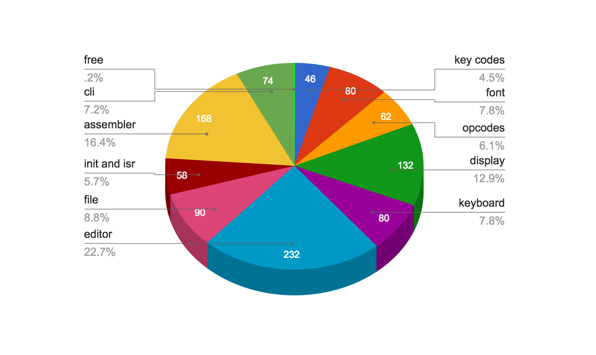
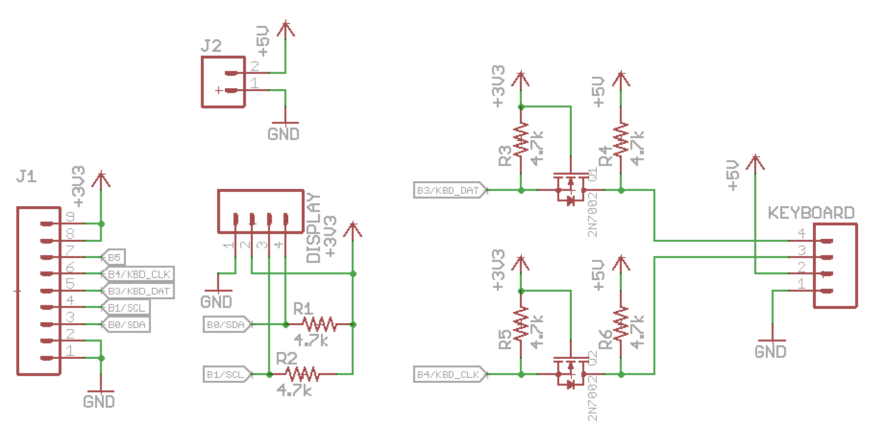

One Kilobyte Operating System (OKOS)
================

Tiny OS for 1kB challenge.

Blurring the line between embedded system and general purpose computer. Inspired by all those wizardly tricks that brought computing to the masses on limited hardware.

Features
---

* Runs on a PIC18f25k50, the MCU in the HaD SuperCon Badge!
* Display driver and API
	* Supports SSD1306 OLED display with 128x64 pixels over i2c.
	* Minimal 3x5 tiny font (remember original Apple ][ uppercase only font?)
	* Line buffered text drawing api (write whole row at a time)
	* Optional lowercase font, with descender support 3x5.5! But it takes 10 more bytes to support :(
	* Check out git history for a full ascii compatible font + display driver in less than 400 bytes.
* Filesystem (if you can call it that)
	* Actually just chopping 32k flash into 16 * 2k files.
	* 15 files available to user numbered 1-F. Can be either text files or programs.
* Keyboard driver and api
	* PS2 keyboard interface. You probably want an extended keyboard with a numeric keypad (more on that later).
	* Minimal scan code map/table.
	* Keyboard gives you repeat for free.
* Very basic command line interface lets you edit files, assemble them, and run programs
* Minimal instruction set assembler for the PIC MCU
	* What kind of OS doesn't let you write code?!?
	* Minimal, but workable, instruction set support.
	* Writes executable machine code into another file. Not interpreted!
* Visual Text Editor
	* Hopefully better than edlin
* Run
	* User program takes over
	* Core API available
	* User program interrupts supported (ISR vector depends on what program is running)
* OKOS is just ok because OKOS is just OK.

One Kilobyte
---




Visual Text Editor
================

Edit a text file with `e <file>` e.g. `e 1` to edit the text file `1`.

The current line will have an arrow in the left-side gutter. Arrow keys are not supported, but instead the keypad 8 (up) and 2 (down) keys are used for navigating. You can scroll through the file with these arrow keys.

The cursor is always at the end of the line. You can delete with backspace (including over newlines), or type to add more characters to a line. Pressing enter will append a newline.

Save the file with the `F1` key.

Assembler
================

Assemble a file with `a <source> <out>` e.g. `a 1 2` assembles source code in file `1` writing the executable to file `2`.

Minimal usable PIC instruction set.

3 character mnemonics to save space.

* `;` for comments, can be anywhere
* `.` on a line alone to end the file/parsing. **REQUIRED**


User ISR starts at offset **`0x04`** or. This gives you enough room to jump away at the start of your program.
Boilerplate program with an ISR:

```
bra 0012 ; jump past ISR
; insert your ISR code here
; ...
bra 000b ; execute a return
; at address 12. insert your code here
. ; EOF
```

User memory starts at address 0x3A, with the line buffer at 0x1A, anything before that is needed by the core API. If you don't use the API, feel free to reclaim this memory! Note that if you use ISRs, address 0x00 controls which file block the ISR jumps to.

Unfortunately, there wasn't enough room to support labels.

#### Instruction Set

| PIC instruction | short mnemonic | args | notes |
| --- | --- | --- | --- |
| bcf | bcf | f, b | 1 instruction |
| bsf | bsf | f, b | 1 instruction |
| btfsc | btc | f, b | 1 instruction |
| btfss | bts | f, b | 1 instruction |
| movlw | mvl | k | 1 instruction |
| movwf | mvw | f | 1 instruction |
| movf | mvf | f, d | 1 instruction |
| addwf | add | f, d | 1 instruction |
| andwf | and | f, d | 1 instruction |
| iorwf | ior | f, d | 1 instruction |
| xorwf | xor | f, d | 1 instruction |
| rlcf | rlc | f, d | 1 instruction |
| rrcf | rrc | f, d | 1 instruction |
| goto | bra | k | 2 instructions<br>target address is doubled. Think of them as instruction word addresses instead of byte addresses. File 1 starts at `0x400`|
| call | cal | k | 2 instructions. Same addressing as goto |
| return | - | - | NOT IMPLEMENTED<br>Use **`bra b`** |

**NOTE** return is not implemented, but a return instruction is placed at address 0x16 (word 0xb), jumping there will effect a return.


#### Core API

These API are available and potentially useful to user written programs.

| Routine           | address    | cal address | Notes   |
| ----------------- | ---------- | ----------- | ------- | 
| return_bra        | 0x000016   | 000B        | Use this to return. |
| oledDrawFlushLine | 0x00012c   | 0096        | write up to 32 characters to 0x1A. Filled with spaces on return. | 
| readKey           | 0x00015c   | 00AE        | Waits for keypress, returns character in WREG, also in 0x03. Blocks until key is pressed. You probably want to write something better in an ISR. |
| openFile          | 0x0002d2   | 0169        | Sets up TBLPTR for reading/writing to the given file in WREG |
| fputc             | 0x000294   | 014A        | Writes a byte in WREG, flushing pages as needed |
| flushLastPage     | 0x0002a2   | 0151        | If bit 0 in memory 0x01 is set, you need to call this once to flush the last page, since pages are only flushed by fputc in 64b increments. |


Running Programs
================

Once you've written and assembled an executable, you can run with with `r <file>` e.g. `r 2` to run file `2`.

Your program takes over until the computer is reset.

Hardware
================

OKOS was written on and designed to run on the PIC MCU in the HaD SuperCon badge. The badge exposes a few GPIO, with i2c support. A small bit of interface hardware is required for i2c, and to level shift the 5v PS2 keyboard signals. This was assembled on a home made toner transfer PCB.



Notes
================

### Character set

Supports 0-9, a-z, period, semicolon, space, newline, esc, F1, backspace, Keypad 2,8,6

Maps directly to hex, such that 0x0 => '0', 0xa => 'A'.

### keyboard

Supports PS2 keyboards, decode scancodes into character set.

* simple protocol
* can ignore keyup. 
* ignore most special keys.

### filesystem

* pic18f25k50 has 32k flash. Split into 16 "files" of 2k each. file 0 (half of it anyway) contains OKOS.
* There wasn't enough space to do much else


### display

* the 128x64 oled needs very little setup.
* could get 10 lines of text (+ 4 pixels spare), but requires extra bit shifting. 8 lines of 8 pixels is easy w/ the displays 8 bit tall row x 128 segments.
* Each font face is 15 bits. To save space, only uppercase is supported, though the code can support lowercase and even use the 16th bit to shift down for lowercase descenders with 10 more bytes of code.
* Originally it rendered characters on the fly and send to display, but positioning and redraw was difficult. Now uses a line buffer and draws one row at a time, and is faster.

### MCU

Microchip PIC18f25k50

* uses 16-bit instruction words, and can store 2-8bit bytes per word easily.
* has 32k of flash, leaving plenty for filesystem
* Has almost enough RAM to fit entire 2k "file" into memory. 
* Also happens to be in the HaD SuperCon Badge.


1K Mapfile evidence
========

Here's the mapfile section info. Note that configuraton fuses are located at `0x300000` and are not actually program flash, the programm usage calculation is flawed! Program memory ends (and includes) address `0x0003fd` - 1022 bytes. Also `.cinit` is a bug/feature of MPLAB that could be removed with a custom linker file.

```
MPLINK 5.08, LINKER
Linker Map File - Created Sun Dec  4 17:28:46 2016

                                 Section Info
                  Section       Type    Address   Location Size(Bytes)
                ---------  ---------  ---------  ---------  ---------
                 RES_VECT       code   0x000000    program   0x000008
                  HIGHISR       code   0x000008    program   0x000010
                   LOWISR       code   0x000018    program   0x000004
               TABLE_DATA       code   0x00001c    program   0x0000ba
                   .cinit    romdata   0x0000d6    program   0x000002
                MAIN_PROG       code   0x0000d8    program   0x000326
.config_300000_BUILD/DEFAULT/PRODUCTION/MAIN.O    romdata   0x300000    program   0x000001
.config_300001_BUILD/DEFAULT/PRODUCTION/MAIN.O    romdata   0x300001    program   0x000001
.config_300002_BUILD/DEFAULT/PRODUCTION/MAIN.O    romdata   0x300002    program   0x000001
.config_300003_BUILD/DEFAULT/PRODUCTION/MAIN.O    romdata   0x300003    program   0x000001
.config_300005_BUILD/DEFAULT/PRODUCTION/MAIN.O    romdata   0x300005    program   0x000001
.config_300006_BUILD/DEFAULT/PRODUCTION/MAIN.O    romdata   0x300006    program   0x000001
.config_300008_BUILD/DEFAULT/PRODUCTION/MAIN.O    romdata   0x300008    program   0x000001
.config_300009_BUILD/DEFAULT/PRODUCTION/MAIN.O    romdata   0x300009    program   0x000001
.config_30000A_BUILD/DEFAULT/PRODUCTION/MAIN.O    romdata   0x30000a    program   0x000001
.config_30000B_BUILD/DEFAULT/PRODUCTION/MAIN.O    romdata   0x30000b    program   0x000001
.config_30000C_BUILD/DEFAULT/PRODUCTION/MAIN.O    romdata   0x30000c    program   0x000001
.config_30000D_BUILD/DEFAULT/PRODUCTION/MAIN.O    romdata   0x30000d    program   0x000001
               .udata_acs      udata   0x000000       data   0x00003c


                              Program Memory Usage 
                               Start         End      
                           ---------   ---------      
                            0x000000    0x0003fd      
                            0x300000    0x300003      
                            0x300005    0x300006      
                            0x300008    0x30000d      
            1034 out of 33048 program addresses used, program memory utilization is 3%
```